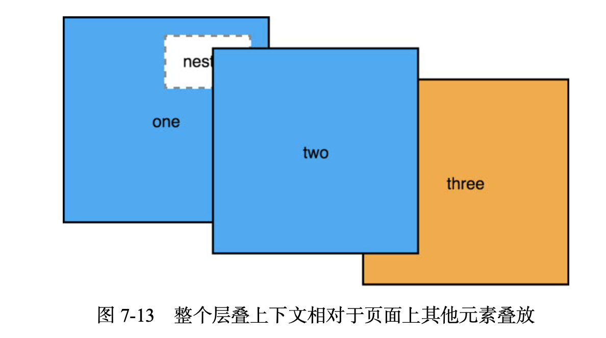

# Portal

在不同层次的 DOM 结构中很难调整前后关系，在下面的层叠上下文 z-index 设置再高也无法盖到上层。

将弹出层这样的结构都用`Portal`渲染到 body 下面。同层级通过 z-index 管理就简单多了。



<code src="./demo.tsx">demo</code>

```ts | pure
import { css } from '@emotion/react';
import Portal from './index';

const style = css`
  color: red;
  position: absolute;
  top: 50%;
  left: 50%;
  transform: translate(-50%, -50%);
`;

function Demo() {
  return <Portal css={style}>portal</Portal>;
}

export default Demo;
```
